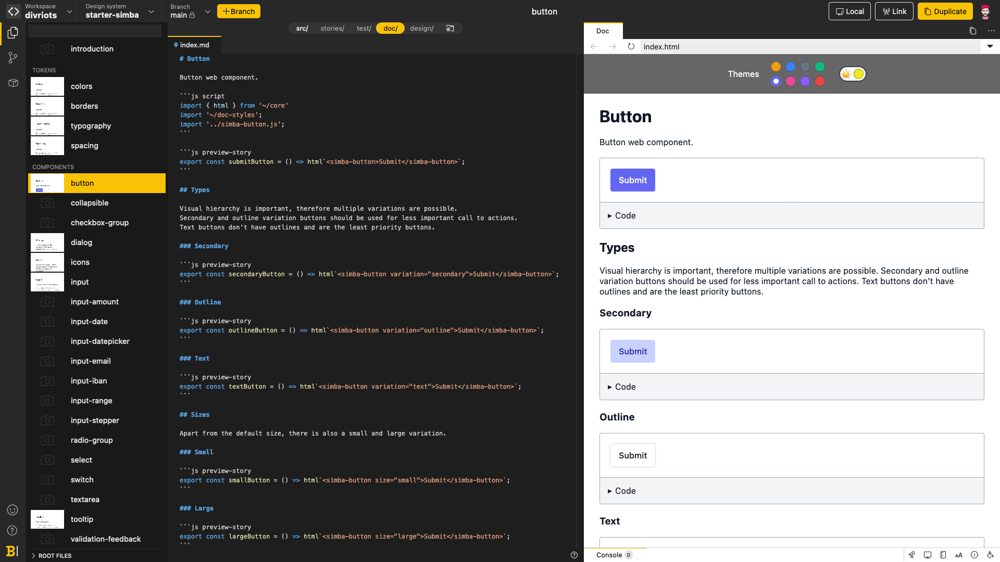

The Eternal Sunshine of the

---

# The Modern <mark>Front-end</mark> Development Stack

- Templating Engines
- CSS Pre-processors
- PostCSS
- Reactive UI Framework
- Packer/Bundler
- Web Dev Server/Hot-Reload/HMR

---

<Gif id="3og0ID5AW1SmPuG3u0" caption="npm run dev" class="h-4/5" />

---
layout: leaf
background: img/danist-8Gg2Ne_uTcM-unsplash.jpg
---
<!-- Photo by <a href="https://unsplash.com/@danist07?utm_source=unsplash&utm_medium=referral&utm_content=creditCopyText">贝莉儿 DANIST</a> on <a href="https://unsplash.com/s/photos/build?utm_source=unsplash&utm_medium=referral&utm_content=creditCopyText">Unsplash</a> -->


# Why Do We Compile Websites?

---

# Modules Everywhere

- Inherited from the IIFE pattern
  ```js
  (function(w, d) {
    let bud = 'World';

    w.addEventListener('DOMContentLoaded', (e) => {
      d.getElementById('text').textContent = `Hello ${bud}!`
    });
  })(window, document);
  ```
- CommonJS format vs ES Modules
- Bundling for the Web (Browserify, etc)
- Perfomance matters

---

# The Transpillers

- Better doesn't mean simpler
- Syntactic sugar

<Gif id="3JNGvAym5kKzQrD4xt" caption="Transpilers" class="h-4/5"/>

---

# This is why we're now *compiling* our Websites

- Modules
- Transpillers
- New formats to support (WASM...)
- Performance improvements

---
layout: punch
---

Web Evolved, <br>
we still rely on tough foundations (HTML/CSS/JS) <br>
but we need <mark>high-level</mark> tools daily

---
layout: leaf
background: img/sigmund-4CNNH2KEjhc-unsplash.jpg
---
<!-- Photo by <a href="https://unsplash.com/@sigmund?utm_source=unsplash&utm_medium=referral&utm_content=creditCopyText">Sigmund</a> on <a href="https://unsplash.com/s/photos/pipes?utm_source=unsplash&utm_medium=referral&utm_content=creditCopyText">Unsplash</a> -->

# The '21 Web Building Pipeline

---
layout: punch
---

Easier developers life <br>
means overly complex <br>
DevTools Stack

---

# The Usual Suspects

<v-clicks>

- Webpack: Pack every part of your apps (JS, assets...)
- Rollup/Parcel: Bundle the logics
- Jest: Testing suite
- TypeScript: Improve the language
- Prettier: Reformat
- ESLint: Check the syntax
- NPM/Yarn: Manage dependencies
- any tools specific to your frameworks

</v-clicks>

---
layout: punch
---

_Compiling_ for production <br>
should not be mandatory <br>
during <mark>development</mark>

---

# Improving the ~~User~~ Developer eXperience

- Standardized ESM
- Superset of languages (TS, JSX...)
- Free from loading the whole NPM Registry locally
- Instant Startup!
- Built-in HMR support
- Extensible
- Focusing on dev, launching on prod

---
layout: leaf
background: img/emre-karatas-Ib2e4-Qy9mQ-unsplash.jpg
---
<!-- Photo by <a href="https://unsplash.com/@emrekaratas?utm_source=unsplash&utm_medium=referral&utm_content=creditCopyText">Emre Karataş</a> on <a href="https://unsplash.com/s/photos/speed?utm_source=unsplash&utm_medium=referral&utm_content=creditCopyText">Unsplash</a> -->

# Solving the bottleneck

---

# How does it work?

<v-clicks>

- Use native ESM support in the browser
- Tranform non-JS modules to ESM
- Cache Modules in the Browser
- Use HMR for on-the-fly updates
- Use HTTP[/2] features

</v-clicks>

---

# Dependencies

- Loaded from `node_modules` directly
- _Not_ bundled
- Can be dynamically loaded from a CDN
- Use ESM versions

<v-click>

```js
import confetti from 'canvas-confetti';

confetti.create(document.getElementById('canvas'), {
  resize: true,
  useWorker: true,
})({ particleCount: 200, spread: 200 });
```

</v-click>

---

# On-Request Build Oriented

<Figure src="./img/esm.3070012d.png" caption="The Developement Pipeline" class="h-4/5"/>

::linkroll::
- [Why Vite?](https://vitejs.dev/guide/why.html)
- [How Snowpack Works](https://www.snowpack.dev/concepts/how-snowpack-works)

---
layout: 3-cols
class: sm
---

# The Challengers

::left::

## Snowpack

- The First of Its Kind
- Lightweight and fast
- Agnostic
- Webpack/Parcel support for builds
- Plugins API
- Highly configurable

::middle::

## Vite

- The Leader
- Compatible Vue/[P]React/Svelte/Lit
- `esbuild` for dev | Rollup for builds
- Multi-Page support
- Library Mode
- CSS Code-Splitting
- Standard API

::right::

## WMR

- The Tiny Mouse
- Native import from NPM
- JSX Debug in Browser
- Native CSS Modules
- HMR for Static Assets
- Rollup for builds
- HTTP/2 for dev

---

# Vite, as-a-backend service

<video playsinline autoplay loop class="max-h-full min-w-full m-auto h-4/5">
  <source src="img/backlight_simba_demo.webm" />
  <source src="img/backlight_simba_demo.mp4" />
  
</video>

::linkroll::
- [Backlight.dev Design System IDE](https://backlight.dev/)

---
layout: 2-cols
---

::left::
## Pros

- Blazingly Fast
- Native HMR
- Quick preview even on large codebases
- MD Vue for embedding components

::right::
## Cons

- Error-prone on code analysis for deps
- No MDX native support
- MD Vue isn't standard
- Dedicated worker for Vite previews
  ```
  preview
    -> service-worker
    -> vite-worker
    -> service-worker
  -> preview
  ```

---
layout: punch
---

It's a new generation of Devtools, <br>
lead by great **communities** <br>
(Skypack, Vue, Preact...)

---
layout: punch
---

ESM-Oriented Registries

::linkroll::
- [Skypack](https://www.skypack.dev/)
- [ESM.sh](https://esm.sh/)
- [JSPM](https://jspm.org/)
- [UNPkG](https://unpkg.com/)

---

# Easily Plug it into your existing project

<v-clicks>

1. Imports will still work
2. Few adjustments on edges (`resolve.alias`...)
3. Update `npm scripts`
4. Add `vite.config.js`, and remove Webpack <emojione-party-popper class="inline" />
   ```js
   import { defineConfig } from 'vite';

   import plainText from 'vite-plugin-plain-text';
   import sprites from 'rollup-plugin-sprite';
   import reactRefresh from 'vite-plugin-react-refresh'

   export default defineConfig({
     /* ... */
   });
   ```

</v-clicks>

::linkroll::
- [kresus - Use Vite for bundling](https://framagit.org/kresusapp/kresus/-/merge_requests/1440)
